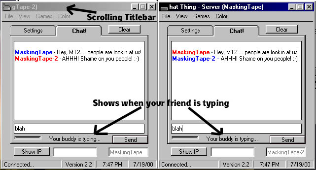

## Chat Thing 2\.2

### Description

Chat Thing is a 1 on 1 chat program with a few interesting features: It has its own web browser (simple, but does the job), it has 2 games you and your friend can play (tic tac toe and rock scissors paper), title bar flashes if the program is minimized and you get a message and much much more! Please vote for me! :-D
 
### More Info
 

             |
---                |---
**Submitted On**   |2000-07-19 19:55:14
**By**             |[MaskingTape](https://github.com/Planet-Source-Code/PSCIndex/blob/master/ByAuthor/maskingtape.md)
**Level**          |Beginner
**User Rating**    |5.0 (35 globes from 7 users)
**Compatibility**  |VB 6\.0
**Category**       |[Internet/ HTML](https://github.com/Planet-Source-Code/PSCIndex/blob/master/ByCategory/internet-html__1-34.md)
**World**          |[Visual Basic](https://github.com/Planet-Source-Code/PSCIndex/blob/master/ByWorld/visual-basic.md)
**Archive File**   |[CODE\_UPLOAD79377192000\.zip](https://github.com/Planet-Source-Code/maskingtape-chat-thing-2-2__1-9895/archive/master.zip)

